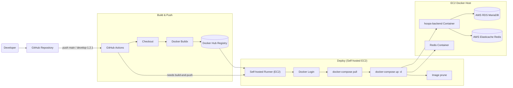

# 🏀 [Hoops] - 위치 기반 실시간 농구 경기 매칭 소셜 웹 서비스

이 리포지토리는 팀 프로젝트 [Hoops](https://github.com/hoops-project)를 포크하여, 포트폴리오용으로 제가 기여한 부분을 상세히 기술하기 위해 작성되었습니다.

## 📂 목차

- [1. 프로젝트 소개](https://github.com/ramyo564/Hoops/edit/main/README.md#-%ED%94%84%EB%A1%9C%EC%A0%9D%ED%8A%B8-%EC%86%8C%EA%B0%9C)
- [2. 아키텍처](https://github.com/ramyo564/Hoops/edit/main/README.md#%EF%B8%8F-%EC%95%84%ED%82%A4%ED%85%8D%EC%B2%98)
- [3. 주요기능](https://github.com/ramyo564/Hoops/edit/main/README.md#-%EC%A3%BC%EC%9A%94-%EA%B8%B0%EB%8A%A5)
- [4. 기여한 부분](https://github.com/ramyo564/Hoops/edit/main/README.md#-%EC%A0%9C%EA%B0%80-%EA%B8%B0%EC%97%AC%ED%95%9C-%EB%B6%80%EB%B6%84-my-contribution)
- [5. 기술스택](https://github.com/ramyo564/Hoops/edit/main/README.md#-%EA%B8%B0%EC%88%A0-%EC%8A%A4%ED%83%9D-tech-stack)


## 📌 프로젝트 소개

이 프로젝트는 제로베이스에서 7인 팀으로 진행한 파이널 프로젝트로,   
농구를 좋아하는 사람들이 농구 경기를 운영하기 위한 최소 인원을 위치 기반으로 손쉽게 모으기 위한 소셜 웹 서비스입니다.

  - **팀 구성:** 프론트엔드 3명, 백엔드 4명
  - **개발 기간:** 2024.04 \~ 2024.08
  - **👉 원본 팀 프로젝트 리포지토리:** [https://github.com/hoops-project](https://github.com/hoops-project)
  - **👉 서비스 시연 영상:** [🎥https://player.vimeo.com/video/972786007?h=cc66d8cf59](https://player.vimeo.com/video/972786007?h=cc66d8cf59)

<br>  


## 🏗️ 아키텍처

### 백엔드 아키텍처

```mermaid
graph TD
  %% Users Domain
  subgraph Users
    AuthController-->AuthService-->AuthRepository
    AuthService-->EmailRepository
    UserController-->UserService-->UserRepository
  end

  %% Friends Domain
  subgraph Friends
    FriendController-->FriendService-->FriendRepository
    FriendRepository-->FriendCustomRepository
  end

  %% Game Domain
  subgraph Game
    GameController-->GameService-->GameRepository
    ParticipantGameController-->ParticipantGameService-->ParticipantGameRepository
    GameUserController-->GameUserService-->GameUserRepository
  end

  %% Chat Domain
  subgraph Chat
    ChatController-->ChatService-->ChatRoomRepository
    ChatService-->MessageRepository
    ChatService-->MessageSender-->WebSocketMessageSender
  end

  %% Invite Domain
  subgraph Invite
    InviteController-->InviteService-->InviteRepository
  end

  %% Alarm Domain
  subgraph Alarm
    NotificationController-->NotificationService-->NotificationRepository
    NotificationService-->EmitterRepository
  end

  %% Report Domain
  subgraph Report
    ReportController-->ReportService-->ReportRepository
  end

  %% Manager Domain
  subgraph Manager
    ManagerController-->ManagerService-->BlackListUserRepository
  end

  %% Security & Config
  subgraph Security
    JwtAuthenticationFilter-->TokenProvider
    TokenProvider-->JwtExceptionFilter
    WebSecurityConfig-->JwtAuthenticationFilter
  end

  %% External Systems
  MariaDB[("MariaDB")] -.-> GameRepository
  MariaDB -.-> UserRepository
  MariaDB -.-> FriendRepository
  MariaDB -.-> ParticipantGameRepository
  MariaDB -.-> GameUserRepository
  MariaDB -.-> InviteRepository
  MariaDB -.-> NotificationRepository
  MariaDB -.-> ReportRepository
  MariaDB -.-> BlackListUserRepository
  MariaDB -.-> ChatRoomRepository
  MariaDB -.-> MessageRepository

  Redis[("Redis")] -.-> AuthRepository
  Redis -.-> EmailRepository
  Redis -.-> EmitterRepository

  WebSocket(("WebSocket")) -.-> ChatService
  SSE(("SSE")) -.-> NotificationService
```




### CI/CD 아키텍처



### ERD


<br>

## ✨ 주요 기능

### 🏀 경기 관리

- **경기 생성 및 관리**: 3:3, 5:5 경기 생성, 제목/내용/세부사항 수정
- **동적 검색 및 필터링**: 날짜, 도시, 성별, 경기방법, 경기장소 등 조건별 검색
- **참가자 관리**: 경기 지원자 목록 조회, 수락/거절, 강퇴 기능
<details>
<summary><b> gif 이미지 펼쳐보기 (클릭)  👈 </b></summary>
<div markdown="1">

| 🏀 경기 생성 🏀                                                                                                                | 🏀 경기 필터링 🏀                                                                                                               |
| -------------------------------------------------------------------------------------------------------------------------- | -------------------------------------------------------------------------------------------------------------------------- |
|  |  |
| 🔅 경기 일정을 생성하고 팀원을 모집할 수 있어요 🔅                                                                                            | 🔅 지역, 성별, 실내외, 경기형식 등을 선택해서 경기를 볼 수 있어요 🔅                                                                                |
</div>
</details>
<br>  

### 👥 소셜 기능

- **친구 시스템**: 친구 검색, 신청, 수락/거절, 삭제
- **실시간 채팅**: WebSocket 기반 경기별 전용 채팅방
- **경기 초대**: 친구 목록을 통한 경기 초대 및 수락/거절
<details>
<summary><b> gif 이미지 펼쳐보기 (클릭)  👈 </b></summary>
<div markdown="1">

|  🏀 경기 초대 및 수락 🏀      |  🏀 경기 신청 및 수락 🏀                                         |
|--------------------------|-----------------------------------------------|
|||
|🔅 경기에 친구를 초대하고 수락할 수 있어요 🔅|🔅 참가하고 싶은 경기에 신청을 하고 수락할 수 있어요 🔅|

|  🏀 친구 검색 및 친구신청 🏀      |  🏀 채팅 🏀                                         |
|--------------------------|-----------------------------------------------|
|||
|🔅 친구를 검색하고 친구신청을 할 수 있어요 🔅|🔅 경기에 참가하는 팀원들끼리 채팅할 수 있어요 🔅|
</div>
</details>
<br>  


### 🔒 보안 및 관리

- **JWT 기반 인증**: 일반 로그인 + 카카오 OAuth2 로그인
- **이메일 인증**: 회원가입 후 이메일 인증을 통한 계정 활성화
- **신고 및 블랙리스트**: 비매너 유저 신고 및 관리자 블랙리스트 관리
- **매너 포인트**: 경기 종료 후 상호 평가 시스템
<details>
<summary><b> gif 이미지 펼쳐보기 (클릭)  👈 </b></summary>
<div markdown="1">

|  🏀 회원가입 및 이메일 인증 🏀      |  🏀 카카오톡 로그인 🏀                                         |
|--------------------------|-----------------------------------------------|
|||
|🔅 회원가입 후 이메일 인증을 통해 더 안전하게 사용할 수 있어요 🔅|🔅 카카오톡 로그인을 하여 더욱 간단하게 로그인이 가능해요 🔅|

|  🏀 매너 점수 평가 🏀      |  🏀 블랙리스트 🏀                                         |
|--------------------------|-----------------------------------------------|
|||
|🔅 경기에 참여했던 팀원의 매너점수를 평가할 수 있어요 🔅|🔅 비매너인 사용자를 신고할 수 있어요 🔅|
</div>
</details>
<br>  

### ⏰ 알림 시스템

- **실시간 알림**: SSE(Server-Sent Events) 기반 실시간 알림
- **다양한 알림 유형**: 지원자 수락/거절, 친구 신청, 신고 접수 알림


---
  
<br>


## 🔥 제가 기여한 부분 (My Contribution)

프로젝트의 백엔드 파트를 담당하며, 안정적인 서비스 운영을 위한 핵심 기능들을 구현했습니다.   

> (담당 패키지: chat, commonResponse, gameUsers, manager, reports, CI/CD)

<br>
<details>
<summary><b>📄 제가 담당한 파일 목록 보기 (클릭)  👈 </b></summary>
<div markdown="1">

```
.github
 ┗ workflows
 ┃ ┗ hoops-backend-build-and-push.yml  👈

hoops
 ┣ alarm
 ┣ chat 👈
 ┣ commonResponse 👈 
 ┣ config
 ┃ ┣ AsyncConfig.java
 ┃ ┣ JpaAuditingConfiguration.java  👈 
 ┃ ┣ JwtParserConfig.java 👈 
 ┃ ┣ QueryDslConfig.java
 ┃ ┣ RedisConfig.java
 ┃ ┣ SwaggerConfig.java
 ┃ ┣ TimeConfig.java
 ┃ ┣ WebSecurityConfig.java 👈
 ┃ ┣ WebSocketConnectionConfig.java 👈
 ┃ ┗ WebSocketConnectionEventListener.java 👈
 ┣ entity
 ┃ ┣ BlackListUserEntity.java 👈
 ┃ ┣ ChatRoomEntity.java 👈
 ┃ ┣ FriendEntity.java 
 ┃ ┣ GameEntity.java 
 ┃ ┣ InviteEntity.java
 ┃ ┣ MannerPointEntity.java 👈
 ┃ ┣ MessageEntity.java 👈
 ┃ ┣ NotificationEntity.java
 ┃ ┣ ParticipantGameEntity.java
 ┃ ┣ ReportEntity.java 👈
 ┃ ┗ UserEntity.java
 ┣ exception 
 ┣ friends
 ┣ gameCreator
 ┣ gameUsers 👈
 ┣ invite 
 ┣ manager 👈
 ┣ reports 👈
 ┣ users
 ┗ HoopsApplication.java
 
 Dockerfile 👈
 docker-compose.yml 👈
```

</div>
</details>

<br>

### 1. 실시간 채팅 기능 개발 (WebSocket, STOMP)

> 경기에 참여한 팀원들 간의 실시간 소통과 커뮤니티 활성화를 위해 웹소켓 기반의 채팅 기능을 개발했습니다.

<br>


[ 🎥 영상링크 ](https://player.vimeo.com/video/1098994158?badge=0&autopause=0&player_id=0&app_id=58479)


#### 🔧 왜 WebSocket과 STOMP인가?

실시간 채팅 기능을 구현하기 위해 초기에는 일반적인 HTTP Polling 방식을 고려했습니다.   
하지만 이 방식은 클라이언트가 주기적으로 서버에 요청을 보내야 해 **불필요한 리소스 낭비와 서버 부하**를 유발하는 단점이 명확했습니다.   

이를 해결하기 위해, 서버와 클라이언트 간의 **지속적인 양방향 연결**을 제공하는 `WebSocket`을 선택했습니다.   
WebSocket을 통해 서버는 이벤트 발생 시점에만 클라이언트에 메시지를 전송할 수 있어 훨씬 효율적입니다.   
또한, 메시징 프로토콜로 `STOMP`를 함께 사용해 **Publisher/Subscriber 모델을 간단하게 구현**하고, 메시지의 목적지(Destination)를 명확히 하여 채팅 로직을 체계적으로 관리할 수 있었습니다.

<br>

#### ❗ 핵심 문제 해결 과정: '신규 입장자'를 위한 이전 대화 불러오기 기능의 메시지 중복 전송 문제

> 채팅 기능을 구현하며 가장 큰 난관은 **'채팅방에 새로 입장한 사용자가 이전 대화 내용을 볼 수 있게 하는'** 요구사항이었습니다.
  
<br>

- **문제 상황:**

	- 초기 구현 시, 새로운 사용자가 채팅방에 입장하면 DB에서 이전 대화 기록을 조회한 후, 해당 채팅방의 공용 `Topic` (`/topic/chat/room/{roomId}`)으로 메시지를 전송했습니다.   
이 방식은 새로운 사용자에겐 이전 대화가 잘 보였지만, **이미 채팅방에 있던 기존 사용자들에게도 똑같은 과거의 대화 내용이 다시 전송되는 심각한 문제**를 일으켰습니다.
- **원인 분석:** 
	- 문제의 원인은 **메시지 전송 채널을 분리하지 않았기 때문**이었습니다.
    - '모두에게 보내는 실시간 메시지'와 '특정 사용자에게만 보내는 과거 메시지'를 모두 같은 `Topic`으로 처리하다 보니, 의도치 않은 중복 전송이 발생한 것입니다.
- **해결 방안:** 
	- 이 문제를 해결하기 위해 메시지 전송 로직을 두 가지 채널로 분리했습니다.
 
      1. **실시간 메시지 (공용 채널):**
      
          - 사용자가 입력하는 새로운 메시지는 기존처럼 공용 `Topic` (`/topic/chat/room/{roomId}`)으로 전송하여 모든 참여자에게 브로드캐스트합니다.
      2. **과거 메시지 (개인 채널):**
          - 새로운 사용자가 입장할 때 조회하는 과거 대화 기록은 **개인 `Queue` (`/queue/chat/room/{userId}`)** 를 통해 **해당 사용자에게만** 전송하도록 구조를 변경했습니다.

<br>

#### ✅ 개선 결과
- 이 구조 변경을 통해 **기존 사용자들에게 영향을 주지 않으면서** 새로운 입장자에게만 과거 대화 기록을 안전하게 전달할 수 있게 되었습니다.
- 이를 통해 데이터 전송 로직의 정확성을 확보하고 사용자 경험을 크게 향상시킬 수 있었습니다.
- 해결 과정의 상세한 내용은 [블로그 포스팅(채팅)](https://ramyo564.github.io/git_blog/spring_project_hoops/hoops_7/)에 정리해두었습니다.

<br>

---


### 2. 동적 검색 및 필터링 기능 구현 (Specification, API 설계)

> 사용자가 원하는 경기를 날짜, 경기 형식, 지역 등 다양한 조건으로 손쉽게 찾을 수 있도록 유연하고 확장 가능한 검색 API를 설계하고 구현했습니다.

<br>


[ 🎥 영상링크 ](https://player.vimeo.com/video/1098996866?badge=0&amp;autopause=0&amp;player_id=0&amp;app_id=58479)


#### 🔧 수많은 필터 조합을 어떻게 효율적으로 처리할 것인가?

가장 큰 기술적 과제는 **다양한 필터링 조건(날짜, 성별, 경기 방식 등)이 조합될 때마다 동적으로 쿼리를 생성**하는 것이었습니다.   
`if-else` 분기문으로 모든 경우의 수를 처리하는 것은 코드의 복잡도를 높이고 유지보수를 어렵게 만든다고 판단했습니다.   
이에 동적 쿼리 생성을 위한 두 가지 기술, `QueryDSL`과 JPA `Specification`(명세)을 놓고 비교 분석했습니다.

- `QueryDSL`은 강력한 기능을 제공하지만, 별도의 라이브러리 추가와 Q-Type 클래스 생성 단계가 필요했습니다.
- `Specification`은 Spring Data JPA에 내장된 기능으로, **별도의 의존성 없이** 람다식을 활용해 **직관적이고 재사용 가능한 코드**로 조합 로직을 만들 수 있었습니다.

프로젝트의 필터링 요구사항이 `Specification`으로 충분히 해결 가능하다고 판단하여, 더 **가볍고 간결한 구조**를 위해 최종적으로 `Specification`을 채택했습니다.

<br>

#### ❗ 핵심 문제 해결 과정: 하나의 API, 일관된 응답 (Single Endpoint, Common DTO)

> 단순히 동적 쿼리를 구현하는 것을 넘어, API의 재사용성과 프론트엔드 개발 효율성까지 고려했습니다.

<br>

- **문제 상황:**

	- 조건별 필터링, 주소 검색, 회원이 참여한 경기 조회 등 유사한 경기 목록을 조회하는 기능마다 별도의 API와 응답 형식을 만든다면, 백엔드에서는 코드 중복이 발생하고 프론트엔드에서는 각기 다른 데이터 구조를 처리해야 하는 비효율이 발생합니다.
- **해결 방안:**
    1. **단일 API 엔드포인트 설계:**
    
	    - 여러 API를 만드는 대신, `GET /api/games`라는 단일 엔드포인트를 설계했습니다. 
	    - 이 엔드포인트는 `Specification`을 통해 전달된 파라미터에 따라 필요한 경기 목록을 동적으로 필터링하여 반환합니다.
    2. **공통 응답 DTO(`PageGameSearchResponses`) 도입:** 
	    - 모든 경기 조회 기능이 **동일한 구조의 응답**을 내려주도록 `PageGameSearchResponses`라는 공통 DTO를 만들었습니다. 
	    - 비회원 조회 시에는 사용자 관련 필드를 `null`로 처리하는 등 백엔드에서 로직을 처리하여, 프론트엔드는 언제나 일관된 형식의 데이터를 받을 수 있도록 구현했습니다.

<br>

#### **✅ 개선 결과:** 

- 이러한 설계를 통해 **백엔드 코드의 중복을 제거하고 재사용성을 극대화**했습니다. 
- 프론트엔드 개발팀은 **하나의 데이터 모델만으로 다양한 경기 목록 화면을 구현**할 수 있게 되어 개발 효율성이 크게 향상되었습니다. 
- 또한, Spring Security 설정을 통해 비회원도 API를 안전하게 사용할 수 있도록 하여 기능의 범용성을 높였습니다.

<br>

---

### 3. Spring Security 기반의 API 보안 시스템 구축

> 안전하고 신뢰할 수 있는 서비스 환경을 제공하기 위해, Spring Security를 기반으로 **외부의 비인가 접근을 차단(CORS)** 하고 **내부의 악의적인 사용자를 제어(Blacklist)** 하는 다층적 보안 시스템을 설계하고 구현했습니다.

<br>

#### ❗ 핵심 문제 해결 과정: CORS 정책수립 및 동적 블랙리스트 구현

- CORS 정책 수립을 통한 외부 접근제어
- 동적 블랙리스트 시스템을 이용한 사용자 접근 관리

<br>

#### 🔐 1. CORS 정책 수립을 통한 외부 접근 제어

> 백엔드 서버의 보안을 위한 첫 번째 방어선으로, 허가된 출처의 요청만 허용하는 엄격한 CORS(Cross-Origin Resource Sharing) 정책을 수립했습니다.

- **문제 상황:**
  
	- 별도의 CORS 설정 없이는 브라우저의 동일 출처 정책(SOP)에 의해 로컬 개발 환경이나 프로덕션 프론트엔드 서버에서 API를 호출할 수 없습니다. 
	- 반대로 모든 출처(`*`)를 허용할 경우, 악의적인 웹사이트에서 API를 악용하는 CSRF(Cross-Site Request Forgery) 등의 공격에 취약해집니다.
- **해결 방안:**
  
	- Spring Security의 `CorsConfigurationSource`를 사용하여 **허용할 출처를 명시적으로 지정하는 화이트리스트(Whitelist) 방식** 을 채택했습니다.
    - `http://localhost:5173`과 같은 개발 환경과 `https://hoops.services` 같은 실제 프로덕션 도메인만 접근을 허용하여 비인가 도메인의 접근을 원천 차단했습니다.
    - JWT 토큰 기반 인증을 위해, 클라이언트가 응답 헤더에서 토큰을 읽을 수 있도록 `addExposedHeader("Authorization")` 설정을 추가했습니다.

<br>

#### 🛡️ 2. 동적 블랙리스트 시스템을 이용한 사용자 접근 관리

> 건전한 커뮤니티를 유지하고 서비스 운영 정책을 위반한 사용자를 효과적으로 제재하기 위해, 동적 블랙리스트 시스템을 구현했습니다.

- **문제 상황:**

	- 단순히 사용자를 비활성화하는 것을 넘어, **'일정 기간' 동안만 서비스 이용을 제한** 하고 해당 기간이 지나면 자동으로 제재가 해제되는 유연한 시스템이 필요했습니다.
- **해결 방안:**
    1. **기간 기반 엔티티 설계:**
    
	    - `BlackListUserEntity`에 제재 `startDate`와 `endDate`를 필드로 두어 제재 기간을 명확히 관리하도록 설계했습니다.
        - 이를 통해 "10일간 이용 정지"와 같은 구체적인 운영 정책을 시스템에 반영할 수 있었습니다.
    2. **실시간 접근 차단 로직:** 
	    - 사용자의 주요 요청(로그인, 경기 참여 등)이 들어올 때마다 `checkBlackList` 로직을 통해 현재 시간이 사용자의 제재 `endDate` 이전인지 실시간으로 검증했습니다.
        - 만약 제재 기간이 유효하다면, 예외를 발생시켜 즉시 요청을 차단했습니다.
    3. **관리자 기능 구현:** 
	    - 관리자가 필요시 제재를 조기 해제할 수 있는 `unLockBlackList` 메서드를 구현하여 운영의 유연성을 확보했습니다.

<br>

#### ✅ 개선 결과

- **다층적 보안 환경 구축:**

	- 외부의 비인가 출처 접근(CORS)과 내부의 악성 사용자 접근(Blacklist)을 모두 제어하는 통합 보안 계층을 마련했습니다.
- **안전한 API 생태계:** 
	- 화이트리스트 기반의 CORS 정책을 통해 허가된 클라이언트만이 우리 API와 안전하게 통신할 수 있도록 보장했습니다.
- **효율적인 서비스 운영:** 
	- 기간 기반의 자동화된 블랙리스트 시스템을 통해 관리자의 수동 개입을 최소화하면서도 효과적인 사용자 제재 및 커뮤니티 관리가 가능해졌습니다.

<br>

---

### 4. 커뮤니티 자정 작용을 위한 사용자 평가 및 신고 시스템 구축
> 클린한 농구 커뮤니티를 조성하기 위해, 긍정적 행동을 장려하는 **매너 포인트 시스템(Proactive)** 과 부정적 행동을 제재하는 **신고 시스템(Reactive)** 을 유기적으로 연동하여 구현했습니다.

<br>

#### ❗ 핵심 문제 해결 과정: 비매너 유저관리 및 평가 with 관리자 시스템

- 상호 평가 기반의 매너 포인트 시스템 설계
- 비매너 사용자 신고 및 실시간 관리자 알림 시스템

<br>

#### 👍 1. 상호 평가 기반의 매너 포인트 시스템 설계

> 경기 종료 후 참가자들이 서로의 매너를 평가하는 시스템을 도입하여, 사용자 스스로 긍정적인 분위기를 만들도록 유도했습니다.

- **문제 상황:** **동시성 이슈 해결**

	- 가장 큰 기술적 과제는 **동시성(Concurrency)** 문제였습니다.
    - 한 경기에 참여한 여러 플레이어가 특정 사용자의 매너 점수를 **동시에 업데이트** 할 경우, **경쟁 상태(Race Condition)** 가 발생하여 일부 업데이트가 누락되고 데이터의 정합성이 깨질 수 있었습니다.
- **해결 방안:**
    1. **비관적 락(Pessimistic Lock) 적용:** 
		- 데이터의 일관성을 보장하기 위해, 사용자의 매너 점수를 업데이트하는 트랜잭션에 **비관적 락(`@Lock(LockModeType.PESSIMISTIC_WRITE)`)** 을 적용했습니다.
        - 이를 통해 특정 사용자의 점수를 수정하는 동안 다른 트랜잭션의 접근을 막아, 동시 업데이트로 인한 데이터 유실을 원천적으로 방지했습니다.
        
    2. **도메인 객체의 캡슐화:** 
		- 외부에서 엔티티의 상태를 직접 변경하는 `Setter` 사용을 지양하고, `updateMannerScore()`와 같이 **상태 변경 로직을 엔티티 내부에 캡슐화** 했습니다.
        - 이를 통해서 객체의 일관성을 유지하고 예측 가능한 코드를 작성할 수 있었습니다.
        

<br>

#### 🚨 2. 비매너 사용자 신고 및 실시간 관리자 알림 시스템

> 직접적인 제재가 필요한 비매너 행위를 처리하기 위해, 관리자와 직접 연동되는 신고 시스템을 구축했습니다.

- **문제 상황:**

	- 신고가 접수되었을 때, 관리자가 이를 즉시 인지하고 신속하게 대응할 수 있는 체계가 필요했습니다.
- **해결 방안:**
    1. **신고 워크플로우 설계:**
    
	    - 사용자가 특정 유저를 신고하면, 시스템은 먼저 동일 사안에 대한 **중복 신고 여부를 검증**하여 불필요한 데이터 축적을 방지합니다. 
	    - 검증 후 신고 내용을 `ReportEntity`로 데이터베이스에 저장합니다.
    2. **실시간 관리자 알림 (SSE):** 
	    - 신고가 저장되는 즉시, **SSE(Server-Sent Events)** 를 통해 온라인 상태인 모든 관리자에게 **"새로운 신고가 접수되었습니다"** 라는 실시간 알림을 전송합니다. 
	    - 이를 통해 관리자는 별도의 페이지 새로고침 없이 즉각적으로 문제를 인지하고 대응할 수 있습니다.
    3. **블랙리스트 연동:** 
	    - 누적된 신고 내역은 관리자가 사용자를 블랙리스트에 추가할지 판단하는 객관적인 근거 자료로 활용됩니다. 
	    - 신고 승인 시 `ReportEntity`에 `blackListStartDateTime`을 기록하여 제재 이력을 체계적으로 관리합니다.

<br>

#### ✅ 개선 결과

- **커뮤니티 자정 능력 확보:**

	- 매너 포인트 시스템은 긍정적인 상호작용을 유도하고, 신고 시스템은 부정적인 행동을 억제하여 사용자들이 스스로 건전한 커뮤니티를 만들어가도록 기여했습니다.
- **신속한 운영 개입 체계 마련:** 
	- 관리자에게 실시간 알림을 전송함으로써, 문제 발생 시 골든타임을 놓치지 않고 신속하게 개입하여 서비스 안정성을 높였습니다.
- **데이터 기반의 공정한 제재:** 
	- 매너 점수와 신고 이력을 통해 관리자는 감정이 아닌 객관적인 데이터를 기반으로 제재 여부를 결정할 수 있어, 운영의 공정성과 신뢰도를 확보했습니다.


<br>

---

### 5. 재사용 가능한 인증 컴포넌트 설계 및 WebSocket 보안 적용

일관성 있고 테스트가 용이한 인증 로직을 위해 **재사용 가능한 인증 컴포넌트(`JwtTokenExtract`)** 를 설계했습니다.   
이 설계 결정은 프로젝트 막바지에 발견된 **치명적인 WebSocket 보안 허점** 을 신속하게 해결하는 결정적인 포인트가 되었습니다.

<br>

#### ❗ 문제 상황: 분산된 인증 로직과 WebSocket의 보안 공백

프로젝트에는 두 가지 큰 인증 관련 문제가 있었습니다.

1. **인증 로직의 분산:**

	- 컨트롤러, 서비스 등 여러 계층에서 인증된 사용자 정보가 필요했습니다.
    - `SecurityContextHolder`를 직접 사용하거나 `@AuthenticationPrincipal`을 각 메서드에 적용하는 방식은 코드를 반복하게 만들고, 테스트를 어렵게 할 수 있다고 판단했습니다.
2. **WebSocket 보안 허점 발견:** 
	- 프로젝트 마감 직전, 채팅 기능에 대한 최종 검토 중 **누구나 타인의 채팅방에 연결할 수 있는 치명적인 보안 취약점** 을 발견했습니다.
    - HTTP 요청과 달리 프로토콜이 다른 WebSocket은 연결(Handshake) 단계에서 별도의 인증/인가 처리가 반드시 필요했지만, 이 부분이 완전히 누락된 상태였습니다.

<br>

#### 🔧 해결 과정: `JwtTokenExtract` 컴포넌트의 설계와 확장

> 이 문제들을 해결하기 위해, 처음부터 인증 로직을 중앙에서 관리하는 **`JwtTokenExtract` 컴포넌트** 를 설계하고 점진적으로 발전시켰습니다.

<br>

#### 🖥️ 1. 유연하고 테스트 용이한 컴포넌트 설계

처음에는 `static` 메서드로 인증 로직을 구현했지만, **단위 테스트의 어려움**을 겪으며 이것이 안티패턴임을 학습했습니다.   
곧바로 의존성 주입(DI)이 가능하고 테스트가 용이하도록 Spring의 `@Component`로 리팩토링하여, 애플리케이션 전역에서 일관된 방식으로 사용자 정보를 가져올 수 있는 기반을 마련했습니다.

<br>

#### 🛜 2. WebSocket 보안 계층에 인증/인가 로직 적용

발견된 WebSocket 보안 허점을 해결하기 위해, 기존 `JwtTokenExtract` 컴포넌트를 확장하여 적용했습니다.

- **1단계 (인증):** `JwtTokenExtract`에 `SecurityContextHolder`에 의존하지 않고, **STOMP 헤더에서 직접 받은 토큰 문자열을 파싱**하여 사용자를 반환하는 `getUserFromToken(String token)` 메서드를 추가했습니다.
- **2단계 (인가):** WebSocket 연결 요청을 가로채는 `ChannelInterceptor`를 구현했습니다. 이 인터셉터는 `CONNECT` 요청이 들어올 때마다 다음을 수행합니다.
    
    1. STOMP 헤더에서 `Authorization` 토큰과 `gameId`를 추출합니다.
    2. `JwtTokenExtract` 컴포넌트로 사용자를 **인증**합니다.
    3. 인증된 사용자가 해당 `gameId`의 경기에 **참여가 승인된 멤버인지** DB를 조회하여 **인가** 절차를 수행합니다.
    4. 인가에 실패하면 **예외를 발생시켜 WebSocket 연결 자체를 차단**합니다.
 
<br>

#### ✅ 개선 결과

- **WebSocket 보안 강화:** 
	- 오직 **인증되고 인가된 사용자**만이 채팅방에 연결할 수 있도록 WebSocket 프로토콜 레벨에서 보안을 강화하여, 치명적인 정보 유출 및 간섭 위험을 원천적으로 차단했습니다.
    
- **높은 코드 품질 및 유지보수성:** 
	- 인증/인가 로직을 `JwtTokenExtract`라는 단일 컴포넌트에 중앙화하여 코드 중복을 제거하고, 시스템 전체의 유지보수성을 크게 향상시켰습니다.
    
- **신속한 위기 대응 능력 증명:** 
	- 초기에 내렸던 **'재사용 가능한 컴포넌트 설계'** 라는 결정 덕분에, 프로젝트 막바지의 긴급한 보안 위기 상황에 신속하고 체계적으로 대응할 수 있었습니다. 이는 좋은 설계의 중요성을 체감한 값진 경험이었습니다.

<br>

---

### 6. DevOps: CI/CD 파이프라인 구축 및 인프라 비용 최적화

프로젝트의 안정성과 개발 생산성을 높이기 위해, 수동 배포 환경을 자동화하고 AWS 인프라 비용을 최적화하는 CI/CD 파이프라인을 구축했습니다.

<br>

#### ❗ 문제 상황: 수동 배포의 한계와 비효율적인 인프라 비용

프로젝트 초기에는 다음과 같은 심각한 문제들을 겪고 있었습니다.
1. **반복적인 수동 배포:** 

	- 기능 수정 시마다 개발자가 직접 EC2 인스턴스에 접속해 소스 코드를 받고, 빌드 후 실행하는 과정을 반복했습니다. 이로 인해 배포에 많은 시간이 소요되었고, 프론트엔드 팀은 백엔드의 변경 사항이 적용될 때까지 무작정 기다려야 했습니다.
2. **불안정한 개발 환경:** 
	- 팀원마다 다른 PC 환경(Mac/Win)으로 인해 로컬에서 서버 실행에 실패하는 경우가 잦았고, Redis 등 의존성 서비스의 버전 문제도 발생했습니다.
3. **과도한 인프라 비용:** 
	- 초기에는 불안정한 EC2 내 Redis 대신 AWS ElastiCache를, DB는 Public IP를 할당한 RDS를 사용하며 불필요한 비용이 발생했습니다. 결국 비용 문제로 테스트 서버가 자주 중단되어 실 서비스 환경 테스트가 어려웠습니다.

이러한 문제들을 해결하기 위해 **Docker를 통한 환경 표준화**, **GitHub Actions를 이용한 배포 자동화**, 그리고 **AWS 리소스 최적화**를 목표로 삼았습니다.


<br>

#### 🔧 해결 과정 및 시스템 설계

#### 🔑 1. Docker를 이용한 개발/배포 환경 표준화

가장 먼저 "제 PC에서는 잘 되는데요?" 문제를 해결하기 위해 Docker를 도입했습니다.

- **환경 일치:** 

	- `Dockerfile`을 작성하여 Java 버전, OS, 의존성 등을 포함한 백엔드 실행 환경을 이미지로 만들었습니다. 이를 통해 모든 팀원이 동일한 환경에서 개발하고, 서버 역시 동일한 환경에서 구동되도록 보장했습니다.
- **이미지 용량 최적화:** 
	- `Multi-stage Build` 방식을 적용하여, 소스 코드를 빌드하는 환경과 실제 애플리케이션을 실행하는 환경을 분리했습니다. 최종 이미지에는 컴파일된 `JAR` 파일과 실행에 필요한 최소한의 환경만 포함시켜 이미지 크기를 **약 600MB에서 250MB로 58%가량 줄였고**, 이는 이미지 전송 및 배포 시간을 단축하는 효과로 이어졌습니다.
- **의존성 관리:** 
	- `docker-compose.yml`을 사용하여 Spring Boot 애플리케이션과 Redis 컨테이너를 함께 관리했습니다. `depends_on` 옵션으로 서비스 실행 순서를 명시하여 안정성을 확보했습니다.
    

**[📄 Dockerfile 보기 (클릭)](https://github.com/hoops-project/backend/blob/main/Dockerfile)**    
**[📄 docker-compose.yml 보기 (클릭)](https://github.com/hoops-project/backend/blob/main/docker-compose.yml)**

<br>

#### 🔑 2. GitHub Actions 기반의 CI/CD 파이프라인 구축

반복적인 배포 작업을 자동화하기 위해 CI/CD 도구로 GitHub Actions를 선택했습니다. Jenkins와 비교했을 때, 별도의 서버 구축 없이 GitHub 저장소에 내장된 기능을 사용할 수 있어 **비용 및 구현 난이도** 면에서 가장 합리적이었습니다.

- **자동화 워크플로우:**

    1. `main` 브랜치에 코드가 `push` 되면 워크플로우가 자동으로 실행됩니다.
    2. Multi-stage build를 통해 최적화된 Docker 이미지를 빌드합니다.
    3. 빌드된 이미지를 버전 태그와 함께 `Docker Hub`에 푸시합니다.
    4. `Self-hosted Runner`로 지정된 EC2 인스턴스에 SSH로 접속하여 최신 이미지를 `pull` 받고, `docker-compose up` 명령으로 무중단에 가깝게 애플리케이션을 재시작합니다.
    5. 배포 완료 후, 사용되지 않는 이전 Docker 이미지를 자동 삭제하여 EC2 용량을 관리합니다.


**[📄 github actions 보기 (클릭)](https://github.com/hoops-project/backend/blob/main/.github/workflows/hoops-backend-build-and-push.yml)**

<br>

#### 🔑 3. AWS 인프라 최적화 및 비용 절감

자동화와 더불어 불필요한 비용을 줄이는 데 집중했습니다.

- **데이터베이스(RDS):** 

	- RDS의 Public Access를 **비활성화**하고, EC2 인스턴스와 **VPC 내부 통신**으로만 연결했습니다. 이를 통해 Public IP 사용으로 인한 추가 비용을 없애고 보안을 강화했습니다.
- **캐시(Redis):** 
	- 비싼 ElastiCache 대신, Docker Compose를 통해 EC2 인스턴스 내에서 **직접 Redis 컨테이너를 운영**하는 방식으로 전환하여 비용을 크게 절감하고 안정성을 확보했습니다.

#### ✅ 개선 결과

- **완전 자동화된 배포:** 

	- `main` 브랜치에 코드를 푸시하는 것만으로 빌드부터 배포까지 **평균 15분 이상 걸리던 작업을 3분 이내로 단축**했습니다.
- **개발 생산성 향상:** 
	- 프론트엔드 팀은 더 이상 백엔드 배포를 기다릴 필요 없이, 언제나 최신 버전의 API를 기반으로 개발을 진행할 수 있게 되었습니다.
- **인프라 비용 80% 절감:** 
	- ElastiCache와 RDS Public IP 비용을 제거하여 월 AWS 청구 비용을 획기적으로 줄이고, 안정적인 테스트 서버 운영이 가능해졌습니다.
- **안정적인 운영 환경:** 
	- 모든 환경이 Docker로 표준화되어 "제 PC에선 됐는데..." 하는 문제를 원천적으로 차단했습니다.

<br>

---

## 🌱 핵심 성장 경험 (Key Learnings)

- 동시성 제어의 중요성: 

	- 여러 사용자의 동시 요청이 데이터 정합성에 미치는 영향을 체감하고, 비관적 락을 통해 문제를 해결하며 트랜잭션 격리 수준에 대한 깊은 이해를 얻었습니다.
- 프로토콜을 고려한 보안 설계:
	- HTTP와 생명주기가 다른 WebSocket의 보안은 ChannelInterceptor를 통해 연결 단계에서 처리해야 함을 깨닫고, 각 프로토콜에 맞는 보안 전략의 필요성을 학습했습니다.
- 설계의 재사용성과 확장성:
	- JwtTokenExtract 컴포넌트 덕분에 예상치 못한 보안 위기에 신속히 대응할 수 있었고, 이는 모듈화된 설계가 유지보수와 위기 대응에 얼마나 중요한지 보여준 값진 경험이었습니다.
- DevOps 자동화의 실질적 가치:
	- CI/CD 파이프라인 구축을 통해 반복적인 배포 작업을 자동화하며, 개발팀 전체의 생산성을 높이는 DevOps의 실질적인 가치를 체감했습니다.

<br>

## 🚀 기술 스택 (Tech Stack)

### Backend
- **Language**: Java 17
- **Framework**: Spring Boot 3.1.11
- **Libraries**: Spring Web, Spring Data JPA, Spring Security, WebSocket, SSE
- **Authentication**: JWT, OAuth2

### Database & Cache
- **RDBMS**: MariaDB
- **In-memory**: Redis

### DevOps & Cloud
- **Virtualization**: Docker, Docker Compose
- **CI/CD**: GitHub Actions
- **Cloud**: AWS (EC2, RDS, Route53)

### Tools & Testing
- **Build**: Gradle
- **Testing**: JUnit 5, Spring-Boot-Starter-Test
- **Collaboration**: Git, Git Flow, Swagger (springdoc)

